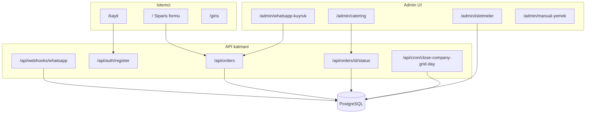

# Asır Sepeti — Mimari analiz raporu

**Kapsam:** Yalnızca mevcut kod tabanı (repo: `master`, Mayıs 2026).  
**Üretim:** Plan doğrultusunda iki tur — (1) özet + P0, (2) tam rapor + roadmap + 7 gün.

---

## Executive summary

1. **Ürün çekirdeği:** B2B müşteri siparişi (vardiya × kategori) → admin **catering onay kuyruğu** → isteğe bağlı **işletmeler grid** güncellemesi (`adminNote` JSON); WhatsApp/manuel kanallar yan giriş.
2. **Mutfak modülü yok;** `KITCHEN` rolü legacy. `PREPARING` / `READY` / `DELIVERED` şemada var, uygulama akışında kullanılmıyor.
3. **İkili veri riski:** Operasyon grid (`Company.adminNote`) ile sipariş satırları (`OrderItem`) yalnızca `PENDING → CONFIRMED` geçişinde senkron; manuel grid, sipariş düzenleme ve ipucu satırları ayrı kaynaklar.
4. **Monolith Next 16 + Prisma + Supabase** yeterli; mikroservis gerekmez. SSE/webhook/cron admin UX ve WhatsApp için değerli, zorunlu değil (polling ile ikame edilebilir).
5. **Production önceliği:** DB şema/migration uyumu, env, açık kayıt ve `/success?orderId=` sızıntısı, çift STANDARD sipariş race’i.

---

## Teknik borç ve riskler

### P0 (canlıya çıkmadan / hemen)

| Risk | Açıklama | İlgili dosyalar | Durum (2026-05-18) |
|------|----------|-----------------|---------------------|
| Şema drift | Az migration dosyası; prod `db push` ile oluşmuşsa `migrate deploy` P3005; eksik kolon P2022 (kayıt/giriş kırılır) | `prisma/migrations/`, `src/app/api/auth/register/route.ts` | ✅ Kod: baseline + partial unique migration eklendi (`0_init_baseline`, `20260518214500_add_order_standard_unique`). 🔲 Prod: `migrate resolve --applied 0_init_baseline` + `migrate deploy` kullanıcı tarafında. Bkz. [deploy-checklist §2-3](./deploy-checklist.md). |
| Env | `DATABASE_URL`, `DIRECT_URL`, `NEXTAUTH_SECRET`, `NEXTAUTH_URL`, `CRON_SECRET`, `INBOUND_WEBHOOK_SECRET` | `.env.example` | ✅ Yerel `.env`: `NEXTAUTH_URL` https:// ile düzeltildi, legacy `KITCHEN_ACCESS_TOKEN` silindi. `src/instrumentation.ts` + `src/lib/env.ts` boot'ta uyarır. 🔲 Vercel UI'da aynı düzeltmeler kullanıcı tarafında. |
| Çift STANDARD sipariş | `@@unique([companyId, orderDate, kind])` yok; eşzamanlı create race | `src/app/api/orders/route.ts`, `src/lib/inbound-promote.ts` | ✅ Partial unique index (`Order_companyId_orderDate_standard_key`) + P2002 yakalama (müşteri, admin, inbound üç kanalda da). |
| Açık kayıt | `/kayit` + `POST /api/auth/register` — onaysız `CUSTOMER` + yeni `Company` | `src/app/kayit/page.tsx`, `src/proxy.ts` matcher | ✅ Politika: açık + koruma. IP saatte 3 deneme, opsiyonel Turnstile (env-gated), proxy `/kayit` matcher'ı + girişli kullanıcı redirect. |
| `/success` sızıntısı | Oturumsuz `orderId` ile sipariş özeti okunur | `src/app/success/page.tsx` | ✅ `cancelToken` URL parametresi (`?orderId=…&t=…`) zorunlu; uyuşmazsa minimal "Siparişiniz Alındı" ekranı. |
| Cron kapalı | `CRON_SECRET` yoksa grid günü arşivlenmez | `src/app/api/cron/close-company-grid-day/route.ts`, `vercel.json` | ✅ Kod: env validator boot'ta uyarır. 🔲 Vercel cron + secret kontrolü kullanıcı tarafında (deploy-checklist §4.3 curl smoke). |

### P1 (operasyon / veri doğruluğu)

| Risk | Açıklama |
|------|----------|
| Grid ↔ sipariş sapması | Onay sonrası `PATCH` miktar değişikliği `adminNote` güncellemez |
| İpucu vs grid matematiği | `company-grid-order-hints` ile `computeGridDeltasFromOrderItems` farklı toplama |
| `SseEvent` / `RateLimitLog` | Append-only; retention yok |
| İstanbul öğle günü vs UTC `orderDate` | Bilinçli ayrım; operasyonel karışıklık riski |
| `WHATSAPP_AUTO_CREATE_ORDER=true` | Yarın teslim için otomatik sipariş; yanlış env tehlikeli |

### P2 (temizlik / UX)

| Risk | Açıklama |
|------|----------|
| `KITCHEN` enum + seed `mutfak@` | Kaldır veya dokümante et |
| Kullanılmayan `OrderStatus` / `ItemStatus` UI | Şema sadeleştir veya mutfak-benzeri ekran planla |
| `.cursorrules` mutfak SSE notu | Güncel değil |

---

## Mevcut mimari haritası

**Auth:** `src/proxy.ts` — matcher: `/`, `/admin/*`. `/kayit`, `/giris`, `/api/*` edge’de korunmaz; API’ler handler içi session/secret.

---

## Kritik akışlar

### Sipariş oluşturma

| Kanal | Endpoint / sayfa | Not |
|-------|------------------|-----|
| Müşteri | `src/app/page.tsx` → `POST /api/orders` | STANDARD: aynı gün çakışma kontrolü; supplement ayrı |
| Kayıt | `src/app/kayit/page.tsx` | Sadece kullanıcı+işletme; sipariş yok |
| Admin manuel | `admin-create-order.tsx` | ADMIN + `companyId`; upsert STANDARD |
| WhatsApp kuyruk | `inbound-messages/[id]/promote` | Admin promote |
| Webhook | `webhooks/whatsapp` | `InboundMessage`; opsiyonel auto-create |

### Onay ve grid

1. Catering listesi: yalnızca `PENDING` (`admin/catering/page.tsx`).
2. Onay: `PATCH .../status` → `CONFIRMED` → `mergeCompanyAdminNoteWithDeltas` + `gridAppliedAt`.
3. Red: `DELETE` sipariş.
4. Gün kapanışı: `runCompanyGridDayClose` — arşiv + sayısal hücre sıfırlama (`company-grid-close.ts`).

### Source of truth önerisi (analiz sonucu)

| Veri | Birincil kaynak | Türev |
|------|-----------------|-------|
| Onaylı talep miktarları | `Order` + `OrderItem` | Grid ipuçları, raporlar |
| Günlük operasyon planı (fabrika tablosu) | `Company.adminNote` (canlı gün) | Arşiv: `CompanyGridDailyArchive` |
| Uyuşmazlık | Grid manuel düzenleme catering onayından bağımsız | Bilinçli çift kayıt; dokümante edilmeli |

---

## Veritabanı notları

- **Güçlü:** `OrderItem` `@@unique([orderId, shift, category])`; `Company.name` unique; grid arşiv `@@unique([companyId, periodStart])`.
- **Eksik:** `Order` için `(companyId, orderDate, kind)` unique — race önleme.
- **`adminNote`:** `__GRID__:` + JSON — esnek, sorgulanamaz; normalize tablo uzun vadede raporlama için düşünülebilir (P2).
- **Migration:** `20260513194500_company_grid_daily_archive` + `DUZ_EKMEK` enum migration; tam geçmiş repoda yok — baseline stratejisi şart.

---

## Önerilen iyileştirmeler

| Öneri | Dosya / alan | Efor | Öncelik |
|-------|----------------|------|---------|
| `@@unique([companyId, orderDate, kind])` veya transaction + lock | `prisma/schema.prisma`, `orders/route.ts` | M | P0 |
| Prod migration baseline + deploy checklist | `docs/`, CI | S | P0 |
| `/kayit` kapatma veya admin onayı | `proxy.ts`, register route | M | P0 |
| `/success` için token veya session | `success/page.tsx` | S | P0 |
| Onay sonrası miktar değişince grid yeniden hesapla veya uyarı | `orders/[id]/route.ts`, `status/route.ts` | M | P1 |
| `SseEvent` / `RateLimitLog` temizlik cron | yeni route veya pg cron | S | P1 |
| Grid ipuçları ile delta formülünü hizala veya dokümante et | `company-grid-order-hints.ts`, `company-admin-grid.ts` | S | P1 |
| E2E: kayıt → giriş → sipariş → onay | `tests/` | L | P1 |
| `KITCHEN` kaldır / enum temizliği | `schema.prisma`, `giris/page.tsx` | S | P2 |
| Kullanılmayan status enum’ları kaldır veya UI bağla | schema + catering | M | P2 |

---

## 3 fazlı roadmap

### Faz A — Production-ready (1–2 hafta)

**Hedef:** Canlı ortamda güvenli giriş, kayıt, sipariş, onay, cron.

| Görev | P |
|-------|---|
| Supabase/Vercel env tam set; `NEXTAUTH_URL` canlı domain | P0 |
| `prisma migrate deploy` veya baseline + deploy | P0 |
| `monthly-menus` bucket + `SUPABASE_SERVICE_ROLE_KEY` | P0 |
| Vercel cron + `CRON_SECRET` doğrulama | P0 |
| Build: `prisma generate && next build` (mevcut) | P0 |
| Kayıt politikası kararı (açık / kapalı / davet) | P0 |
| Admin seed: `ADMIN_EMAIL` / `ADMIN_PASSWORD` + `db:seed` | P0 |

**Risk:** Migration uyumsuzluğu production’da tüm yazma işlemlerini kırar.

### Faz B — Operasyonel sağlamlık (2–3 hafta)

**Hedef:** Veri tutarlılığı ve operasyon güveni.

| Görev | P |
|-------|---|
| STANDARD sipariş unique / idempotent create | P0 |
| Grid ↔ onaylı sipariş tutarlılık (düzenleme sonrası) | P1 |
| WhatsApp parse test seti + `NO_COMPANY` UX | P1 |
| İşletmeler: arşiv günü salt okunur davranışı doğrulama | P1 |
| Hata mesajları (kayıt, sipariş) — mevcut iyileştirmeleri genelle | P1 |
| Smoke test / minimal Playwright | P1 |

### Faz C — Ölçek ve kalite (sürekli)

**Hedef:** Gözlemlenebilirlik, performans, borç azaltma.

| Görev | P |
|-------|---|
| Log aggregation (Vercel + yapılandırılmış hata) | P1 |
| Yük testi: eşzamanlı sipariş create | P2 |
| `SseEvent` retention | P2 |
| Şema sadeleştirme (`KITCHEN`, kullanılmayan status) | P2 |
| Grid normalizasyonu değerlendirmesi (JSON → tablo) | P2 |

---

## İlk 7 gün yapılacaklar (günlük checklist)

| Gün | Odak | Somut çıktı |
|-----|------|-------------|
| **1** | DB gerçeği | Supabase’te tablolar vs `schema.prisma`; SQL ile `CompanyGridDailyArchive`, `app_settings.gridLastArchivedPeriodStart` kontrolü |
| **2** | Migration | `migrate resolve --applied` veya `db push`; local + staging’de `npm run db:seed` |
| **3** | Env + deploy | Vercel env; redeploy; `/giris` admin ile test |
| **4** | Auth/kayıt | Kayıt politikası uygula; `/kayit` test; `register` hata mesajları |
| **5** | Sipariş akışı | Müşteri sipariş → catering onay → grid hücreleri değişti mi kontrol |
| **6** | Cron + WhatsApp | Manuel cron `curl` + secret; webhook secret; kuyruk promote |
| **7** | P0 kod | `@@unique` migration taslağı veya transaction fix; `/success` kısıtı PR |

---

## Tur notları

- **Tur 1 (bu raporun üst bölümü):** Executive summary + P0/P1/P2 tabloları.
- **Tur 2:** Mimari harita, akışlar, DB, iyileştirme tablosu, 3 faz roadmap, 7 günlük plan (bu dosyanın tamamı).

Harici AI için kopyala-yapıştır prompt: [`ai-architecture-analysis-prompt.md`](./ai-architecture-analysis-prompt.md).

---

## Uygulama özeti (2026-05-18)

Tüm P0 maddelerinin **kod düzeyi** karşılığı uygulandı. Production cutover
için kalan adımlar `docs/deploy-checklist.md`'de.

| PR | Kapsam | Dosyalar |
|----|--------|----------|
| 1 | Şema baseline + STANDARD partial unique + race fix | `prisma/schema.prisma`, `prisma/migrations/0_init_baseline/`, `prisma/migrations/20260518214500_add_order_standard_unique/`, `src/app/api/orders/route.ts`, `src/lib/inbound-promote.ts`, `docs/deploy-checklist.md` |
| 2 | Env düzeltme + boot validator | `.env`, `.env.example`, `src/lib/env.ts`, `src/instrumentation.ts`, `docs/deploy-checklist.md` |
| 3 | `/success` `cancelToken` kontrolü | `src/app/success/page.tsx`, `src/app/page.tsx` |
| 4 | Açık kayıt koruması (rate-limit + Turnstile) | `src/lib/rate-limit.ts`, `src/app/api/orders/route.ts`, `src/app/api/auth/register/route.ts`, `src/proxy.ts`, `src/app/kayit/page.tsx`, `src/lib/env.ts`, `.env.example`, `docs/deploy-checklist.md` |
| 5 | Bu rapor + deploy kabul kriterleri | `docs/ai-architecture-analysis-report.md`, `docs/deploy-checklist.md` |

Bir sonraki adım: kullanıcı production cutover'ı `deploy-checklist.md` 1→2→3→4 sırasıyla uygular; sonra P1'lere (`grid ↔ sipariş` sapması, `SseEvent` / `RateLimitLog` retention, WhatsApp parse test seti) geçilir.
